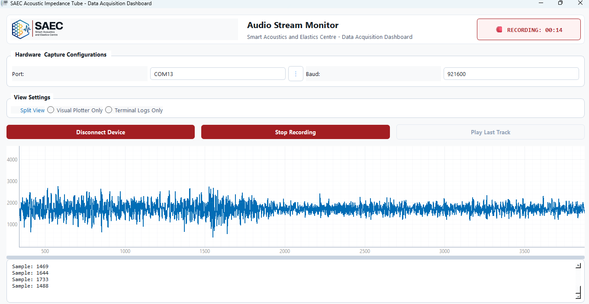

<p align="center">
  
</p>

# SAEC Acoustic Impedance Tube - Data Acquisition Dashboard

This is a real-time data acquisition and testing dashboard for the Smart Acoustics and Elastics Centre (SAEC). It is built in Python to interface with STM32 microcontrollers to test single-microphone sensor functionality before integration into the final WaveView software.



## Features
- **Real-Time Visualization:** View live, auto-scaling waveform plots from your STM32 ADC.
- **Hardware Sync:** Custom, robust 4-byte synchronization algorithm to prevent packet loss.
- **Session Recording:** Capture live streams directly into playable `.wav` audio files.
- **Live Terminal Logging:** Raw value monitoring straight from the serial port.

## STM32 Hardware Packet Format
The dashboard expects data to arrive over UART (921600 Baud) in continuous 4-byte packets:

```c
// Example STM32 Transmission
uint8_t packet[4];
packet[0] = (uint8_t)(mic_value & 0xFF);        // LSB
packet[1] = (uint8_t)((mic_value >> 8) & 0xFF); // MSB
packet[2] = 0xAA;                               // Sync Byte 1
packet[3] = 0xBB;                               // Sync Byte 2

HAL_UART_Transmit(&huart1, packet, 4, HAL_MAX_DELAY);
```

## How to Run

1. Connect your STM32 via USB/UART.
2. Launch the application:
   ```bash
   uv run main.py
   ```
3. In the dashboard:
   - Select your STM32's **COM Port**.
   - Ensure the **Baud Rate** matches your microcontroller (`921600` by default).
   - Click **Connect Device** to begin live streaming.
   - Click **Record Session** to save the incoming audio to the local `recordings/` directory.
