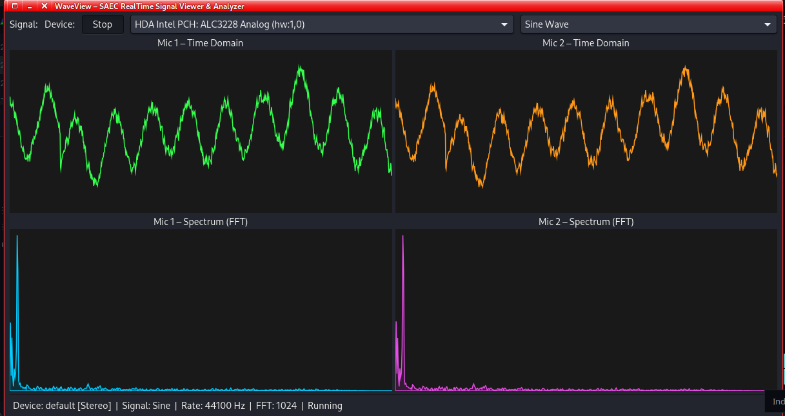

# WaveView - GUI software for the Acoustic Impedance Test Tube
WaveView is a pure‑C, cross‑platform application for real‑time audio capture, waveform visualization, and FFT‑based spectrum analysis. It uses:
- **PortAudio** for low‑latency audio I/O (ALSA on Linux, ASIO/WASAPI on Windows)
- **KissFFT** for fast real‑time FFT
- **GTK4 + Cairo** for a clean, responsive graphical interface.

It is designed as the software frontend for the acoustic impedance tube project, and serves as a general‑purpose audio visualizer and the starting point for more advanced DSP applications.

## Implemeted Features

- 🎤 Real‑time microphone capture (default input device & Two-channel SAEC_DAQ)
- 📈 Live waveform displays (time domain)
- 📊 Live FFT spectrum displays (frequency domain)
- 🔄 Thread‑safe, lock‑free ring buffer for sample transfer
- 🧩 Modular C architecture (for audio, DSP, GUI, ring buffer)
- 🐧 Works on Linux (ALSA) and Windows (ASIO/WASAPI)
- 🖲️ Start/Stop stream control
- 📟️ Device selection to choose input device from dropdown (auto selects SAEC_DAQ)
- 🔊️ Excitation signal generator with freq range and amplitude sliders: 
   1. sine wave ☑️
  2. linear sweep ☑️
  3. white noise (future)
  4. pink noise (future)
  5. brownian noise (future)
  6. logarithmic sweep (next)
- **Dark/Light theme toggle** – for comfortable viewing (activated based on System setting)
- **STM32 USB Audio support** – replaces PC mic stream with custom SAEC_DAQ streams.



        (_**snip: two channel full-duplex stream; sine wave at 440Hz**_)
  
## Planned Features

### 🖥️ GUI Enhancements

- **Multi‑tab display** – separate tabs for waveform, spectrum, transfer function, absorption coefficient plots. (and axes)
- **Peak frequency marker** – click‑to‑measure dominant frequency
- **Data logging** – save raw WAV files, CSV with timestamps, and JSON metadata (sample info)
- **Export plots** – save waveforms/spectrums as PNG


### 📊 Heavy DSP Backend

- **Two‑channel (stereo) and four channel input signal processing**
- **Cross‑spectrum & auto‑spectrum** – `S12`, `S11`, `S22` with averaging
- **Transfer function** – `H12 = S12 / S11`
- **Reflection coefficient** – `R` (complex)
- **Normal incidence absorption coefficient** – `α(f) = 1 - |R(f)|²`
- **Coherence function** – `γ²(f)` to validate measurement quality
- **Surface impedance** – real and imaginary parts
- **Frequency‑dependent uncertainty** – confidence intervals based on coherence

### 🔌 Hardware Integration
- **Simultaneous 4‑channel capture** – for full four‑microphone transmission loss measurements

## Dependencies

| Library | Purpose | Linux package | Windows (MSYS2) package |
|---------|---------|---------------|--------------------------|
| PortAudio | Audio I/O | `libportaudio2`, `portaudio19-dev` | `mingw-w64-ucrt-x86_64-portaudio` |
| GTK4 | GUI | `libgtk-4-dev` | `mingw-w64-ucrt-x86_64-gtk4` |
| Cairo | 2D drawing | `libcairo2-dev` | (included with GTK4) |
| KissFFT | FFT | bundled in `src/external/` | bundled in `src/external/` |

## Building

### On Linux (Debian/Ubuntu/Kali)

1. **Install dependencies**  
   ```bash
   sudo apt update
   sudo apt install cmake gcc libportaudio2 portaudio19-dev libgtk-4-dev libcairo2-dev
2. **clone the repo**
   ```bash
   git clone https://github.com/SAEC-Labs/ImpedanceTube.git
   cd WaveView
3. **buid with Cmake**
   ```bash
   mkdir build && cd build
   cmake ..
   make -j$(nproc)
4. Run the binary.

Note: You can also load the project as a Cmake project in your favorite IDE and build.

## On Windows - Native build with MSYS2
This method builds a native Windows executable inside the MSYS2 UCRT64 environment.

1. **Install MSYS2 from https://www.msys2.org/ and launch the UCRT64 terminal.**
2. **Install Dependencies**
   ```bash
   pacman -S git
   pacman -Syy
   pacman -S mingw-w64-ucrt-x86_64-cmake mingw-w64-ucrt-x86_64-gcc mingw-w64-ucrt-x86_64-portaudio mingw-w64-ucrt-x86_64-gtk4 mingw-w64-ucrt-x86_64-make git
3. **clone and build**
   ```bash
   git clone https://github.com/SAEC-Labs/ImpedanceTube.git
   chdir ImopedanceTube/WaveView/
   mkdir build && chdir build
   cmake .. -G "MinGW Makefiles"
   make -j$(nproc)
4. **Run the `.exe` file**

## Usage
1. Plug in a microphone (or use the built‑in one) or Plug in the in-house custom STM32 SAEC_DAQ
2. Launch the software, preferrably via terminal to see stdout and stderr. Click the Start/Stop button.
3. Open the signal generator dropdown to generate a signal, will play on your inbuilt speaker or plugged in headphones.
    Adjust amplitude and duration and freq ranges for chirps.
4. Speak, whistle, or make noise, the waveforms and FFT spectrums update live as your speaker outputs the generating signal.
5. Close the window or press Ctrl+C to exit.

## Known Issues (_features_)
1. **Mono** mode on Linux shows two streams (two waveforms & two FFT spectra). This is due to the default PulseAudio
   device that reports two channels even though the pc mic is physically mono, our the detection implemented is rather too fragile, making PulseAudio lock us in **Stereo** mode.
   RMS-based detection could resolve this.
2. Noticeable high CPU usage (~37% on Intel Core i5-5200U CPU @ 2.2GHz * 4). The root cause is in the
   `dsp.c`- every call to `compute_spectrum()` which:
- Allocates a new KissFFT config (`kiss_fftr_alloc`)
- Allocates 2 working buffers
- Recomputes the Hann window from scratch (`cosf` per sample)
- Frees everything
- Called 2× per 50ms -> 40 full FFT setups per second, causing the CPU hog.

**Fix**: Pre-allocate FFT config, working buffers, and Hann window only once, then reuse.
 

## Authors & Credits
1. **The awesome SAEC Team** – Bsc. Mechatronic Engineering students, DeKUT
2. **KissFFT** – Mark Borgerding (public domain / BSD)
3. **PortAudio** – PortAudio community (MIT)
4. **GTK** – The GTK team (LGPL)
5. **JetBrains s.r.o** - For renewing my CLion IDE Student's Licence to use for this dev work!

## License
See the `LICENSE` for details

